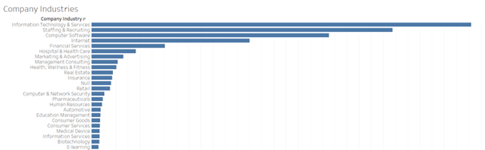
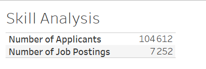
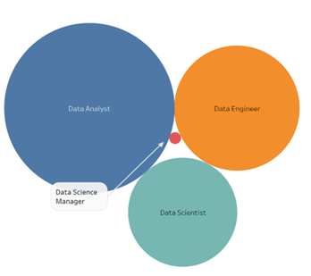
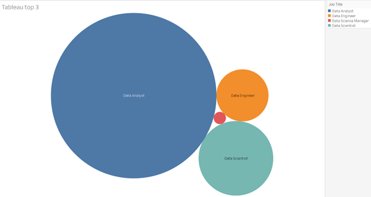
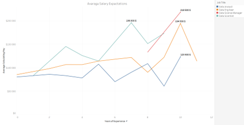

# DataSearch Job Trends Analysis
A comprehensive analysis of job trends and skills within the data science field. This project explores the key drivers of job postings, salary trends, experience levels, and skills in demand, providing actionable insights to guide recruitment strategies.

## Overview
This case study investigates job trends in the data science industry, focusing on job postings, salaries, experience levels, and the demand for specific skills. The project leverages Tableau to analyze data and uncover insights related to the most in-demand job positions and skills.

## Analysis Steps

### Step 1: Data Quality Check
**Objective**: Identify null values and clean the data.
- Null values in "Minimum Pay" represent 90% of the dataset.
- Count of different industries using `COUNTD`: 119.
- Building a bar chart to visualize the companies attracting the most job postings.

### Step 2: Job Posting Trends Over Time
**Objective**: Examine how the number of job postings changes over time.
- Observed a significant drop in March 2020 due to COVID-19.
- Filtered the dataset to focus on the roles: Data Engineer, Data Analyst, Data Scientist, Machine Learning Engineer, Data Science Manager.

### Step 3: Salary vs Years of Experience
**Objective**: Visualize the relationship between salary and years of experience.
- Calculated the average pay and compared it to years of experience.

### Step 4: Job Skills Analysis
**Objective**: Analyze the skills required for various job postings.
- Correlation between the number of applicants and job postings.
- Split job skills into separate categories, focusing on Tableau and other essential tools.

### Step 5: Demand vs Supply by Experience Level
**Objective**: Explore the demand and supply of job postings by experience level.
- Examined the number of postings for each experience level and job position.

### Step 6: Job Titles and Skills in High Demand
**Objective**: Identify the job titles and skills in high demand, particularly Tableau.
- Calculated the top 3 Tableau-related skills in job postings.

### Step 7: Job Description Correlation Analysis
**Objective**: Analyze the correlation between years of experience, level, and role.
- Investigated job titles to understand how these factors correlate within job descriptions.

## Dashboard Insights and Recommendations

### 1. Job Trends Overview
**Description**: This page summarizes job trends, showing the overall number of job postings and how they have evolved over time.
- **Insights**: The number of job postings has been increasing, especially for Data Scientist and Data Engineer roles.

### 2. Job Skills and Positions
**Description**: This page explores the most common skills required across job postings, with a focus on Tableau.
- **Insights**: Tableau is a critical skill in high-demand positions like Data Scientist and Data Analyst.

### 3. Salary Trends and Experience Levels
**Description**: This page compares salary trends across different experience levels.
- **Insights**: Salaries increase with experience, but Data Scientist positions are among the highest paying roles.

### 4. Demand vs Supply by Role
**Description**: This page compares the demand for various job roles with the number of applicants and job postings.
- **Insights**: Data Engineers and Data Analysts have the highest demand but are often in short supply.

## Recommendations
- **Increase focus on high-demand roles**: Data Scientist, Data Engineer, and Data Analyst positions need more attention from recruiters.
- **Target skills like Tableau**: Increase recruitment efforts for candidates with Tableau expertise.
- **Salary Competitiveness**: Ensure salary offerings stay competitive with industry trends, especially for experienced professionals.

## To Go Further
- **Predictive Analytics**: Implement machine learning models to predict job demand trends more accurately.
- **Skill Gap Analysis**: Conduct further analysis on emerging skills to guide future hiring strategies.
- **Longitudinal Analysis**: Continue to track job postings and salary trends to adapt recruitment strategies over time.

## Disclaimer

The data used in this analysis is sourced from DataCamp and is used solely for educational purposes. The analysis, insights, and visualizations provided in this repository are created by the author and are not affiliated with or endorsed by DataCamp. All content in this repository, including the methodology and results, is for personal, academic, and professional development purposes only. The intellectual property rights of the original dataset and any associated content belong to DataCamp.
