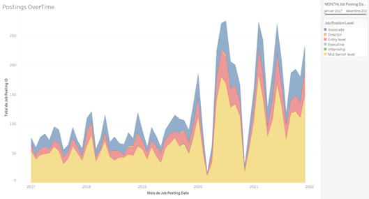
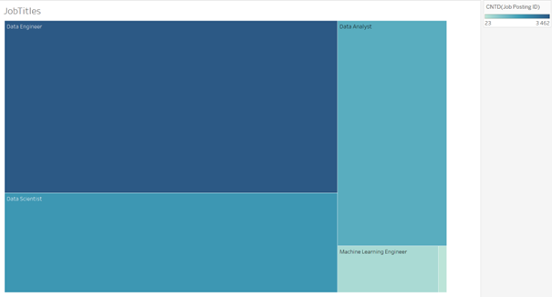
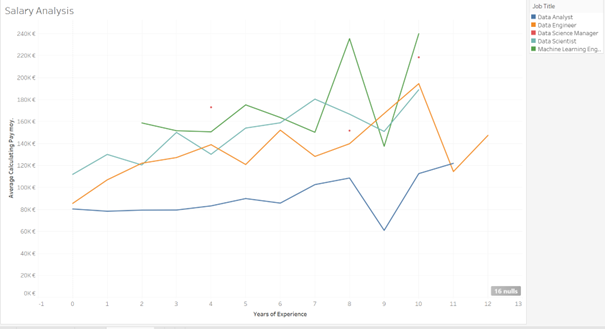
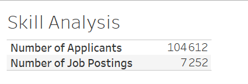
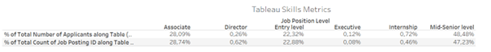
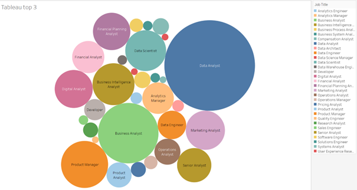
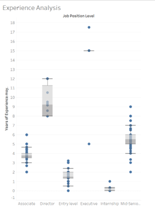
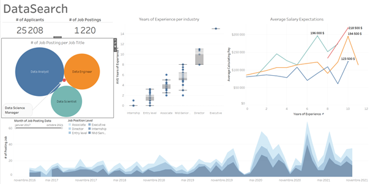

# DataSearch Job Trends Analysis
A comprehensive analysis of job trends and skills within the data science field. This project explores the key drivers of job postings, salary trends, experience levels, and skills in demand, providing actionable insights to guide recruitment strategies.

## Overview
This case study investigates job trends in the data science industry, focusing on job postings, salaries, experience levels, and the demand for specific skills. The project leverages Tableau to analyze data and uncover insights related to the most in-demand job positions and skills.

## Analysis Steps

### Step 1: Data Quality Check
- **Objective**: Identify duplicate entries and missing data.
- **Approach**: Analyzed the "Job Posting Id" as a dimension and checked for null values.
- **Findings**:
  - Null values in the Minimum Pay column represent 90% of the data.
  - 119 different industries in the dataset.

### Step 2: Job Posting Trends Over Time
- **Objective**: Analyze changes in job postings over time.
- **Approach**: Examined job postings month by month.
- **Findings**:
  - March 2020 saw a significant drop in job postings due to COVID-19.
  - Job postings are on the rise again post-pandemic.

### Step 3: Filtering Data by Role
- **Objective**: Focus the analysis on the most relevant data science roles.
- **Approach**: Filtered dataset to include only:
  - Data Engineer
  - Data Analyst
  - Data Scientist
  - Machine Learning Engineer
  - Data Science Manager

### Step 4: Salary vs. Years of Experience
- **Objective**: Understand the relationship between salary and years of experience.
- **Approach**: Calculated average pay by years of experience and visualized the trend.
- **Findings**:
  - Salaries are increasing with years of experience, with a notable jump for roles with 5+ years of experience.

### Step 5: Job Skills Analysis
- **Objective**: Identify the most in-demand job skills.
- **Approach**: Split job skills into individual skills and analyzed the frequency of each.
- **Findings**:
  - Tableau emerged as one of the top three required skills across all job postings.

### Step 6: Demand vs. Supply by Experience Level
- **Objective**: Examine the supply of job postings compared to the demand for various experience levels.
- **Approach**: Visualized the distribution of job postings by experience level.
- **Findings**:
  - There is a significant demand for junior to mid-level roles, especially for Data Analyst and Data Scientist positions.

### Step 7: Job Position Skills Analysis
- **Objective**: Focus on Tableau and its role in job postings.
- **Approach**: Calculated the demand for Tableau skills across various job titles.
- **Findings**:
  - Tableau is required in a high percentage of Data Science, Data Engineering, and Data Analyst roles.

### Step 8: Job Description Correlation Analysis
- **Objective**: Analyze the correlation between years of experience, level, and role.
- **Approach**: Investigated job titles to understand how these factors correlate within job descriptions.
- **Findings**: 

## Dashboard Insights and Recommendations

### 1. **Job Trends Overview**
**Description**: This page summarizes job trends, showing the overall number of job postings and how they have evolved over time.  
- **Insights**:  
  - The number of job postings has been steadily increasing.  
  - Data Scientist and Data Engineer roles show significant growth in demand.  

### 2. **Job Skills and Positions**
**Description**: This page explores the most common skills required across job postings, with a focus on Tableau.  
- **Insights**:  
  - Tableau is a critical skill for high-demand roles like Data Scientist and Data Analyst.  
  - Proficiency in Tableau correlates with higher chances of securing these positions.

### 3. **Salary Trends and Experience Levels**
**Description**: This page compares salary trends across different experience levels.  
- **Insights**:  
  - Salaries tend to increase significantly with experience.  
  - Data Scientist roles are among the highest-paying positions, even for mid-senior level candidates.  

### 4. **Demand vs Supply by Role**
**Description**: This page compares the demand for various job roles with the number of applicants and job postings.  
- **Insights**:  
  - Data Engineers and Data Analysts face the highest demand but are often in short supply.  
  - There is a clear gap between the demand for these roles and the available talent pool.

## Recommendations
- **Increase focus on high-demand roles**: Data Scientist, Data Engineer, and Data Analyst positions need more attention from recruiters.
- **Target skills like Tableau**: Increase recruitment efforts for candidates with Tableau expertise.
- **Salary Competitiveness**: Ensure salary offerings stay competitive with industry trends, especially for experienced professionals.

## To Go Further
- **Predictive Analytics**: Implement machine learning models to predict job demand trends more accurately.
- **Skill Gap Analysis**: Conduct further analysis on emerging skills to guide future hiring strategies.
- **Longitudinal Analysis**: Continue to track job postings and salary trends to adapt recruitment strategies over time.

## Disclaimer

The data used in this analysis is sourced from DataCamp and is used solely for educational purposes. The analysis, insights, and visualizations provided in this repository are created by the author and are not affiliated with or endorsed by DataCamp. All content in this repository, including the methodology and results, is for personal, academic, and professional development purposes only. The intellectual property rights of the original dataset and any associated content belong to DataCamp.
